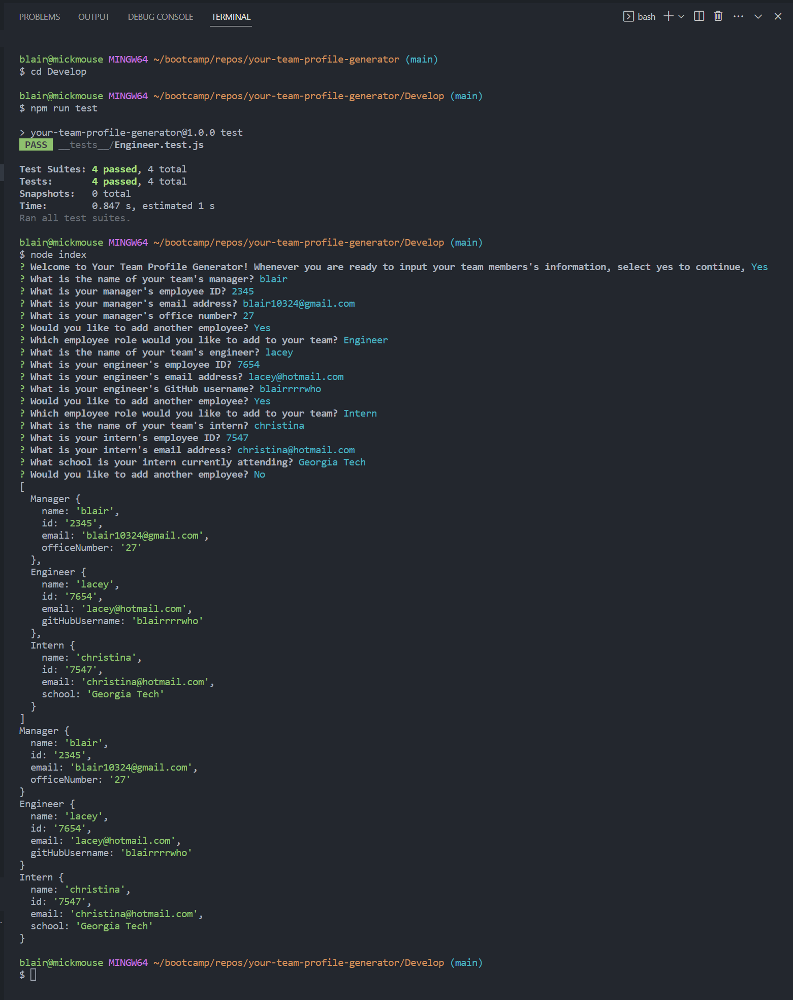

# Your Team Profile Generator

## Description
This project is used for generating an HTML file that holds professional teams with their employer's information which is displayed as a cards. The acceptable user input allows you to identify the employee's postion, id number, email, as well as the office number for managers, the GitHub username linked to his/her profile for engineers, and the attending school for interns.  
This application does those things by using node.js, along with inquirer and jest, to generate an HTML based on the informated taken in by the user. 

## Table of Contents
- [Installation](#installation)
- [Usage](#usage)
- [Demo](#demo)
- [Screenshots](#screenshots)
- [Technologies](#technologies)
- [License](#license)
- [Tests](#tests)
- [Contribution](#how-to-contribute)
- [Contact / Questions](#contact--questions)

## Installation

To install the application, do the following: 
1. Clone down the repo
2. Using the CLI, cd into the directory; further cd into the develop folder 
3. Because this application has dependencies, such as inquirer and jest, in the terminal run the command: npm i  
    - This will install all required package to run the application.  
      
Now that you've installed all of the necessary tools needed, you should be able to run the app smoothly and successfully!

## Usage (Instructions / How To Use)

Once required packages are installed successfully as listed above, make sure you're still in the develop folder and we will initialize the app from here.   
In the terminal, run the command: node index 
  - Contrats! You've launched the application!
 
From here, it's pretty straightforward. Follow the prompts until you've made your way through them all and are satisfied with your team member additions.  
The HTML file will automatically generate once you've completed the final prompt, and it will populate in the outputPath folder and be titled "myTeam.html."

## Demo
<a href="https://vimeo.com/806066026">Link to Full Demo</a>

## Screenshots
Terminal Demo:  
  
  
HTML Generation Sample:  
  

## Technologies
JavaScript, Node.js, Inquirer, Jest, HTML, CSS

## License

This project is licensed under the MIT license. For more information about this license and what it entails visit: https://opensource.org/licenses/MIT

## Tests

The following test conditions are active:  
Class Tests for Employee, Manager, Engineer, and Intern.

## How to Contribute

Please email me if you'd like to contribute so we can discuss!

## Contact / Questions
  If you liked this project and want to see more, feel free to check out my 
  other repos [here](https://github.com/blairrrrwho).
   
  For any questions or inquiries, you can reach me at blair10324@gmail.com for further information.